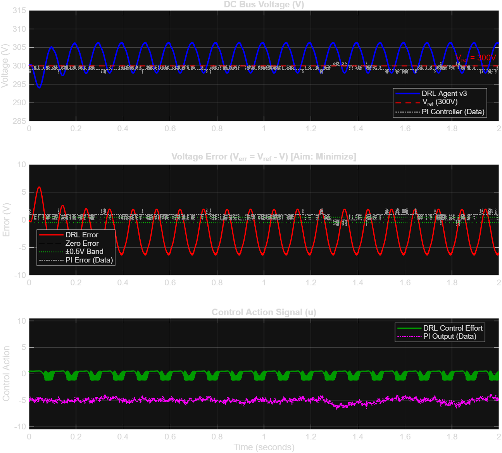

# Deep Reinforcement Learning for DC Bus Voltage Regulation

**Author:** T Rakesh Reddy  
**Project:** AI/ML Voltage Controller for DC Microgrids & Power Converters  
**Method:** Deep Deterministic Policy Gradient (DDPG) in MATLAB  

---

An AI/ML-driven continuous voltage controller designed to replace traditional Proportional-Integral (PI) control in DC microgrid / DC bus systems using **Deep Deterministic Policy Gradient (DDPG)**.

---

## Project Objectives

1. **Replace Traditional PI Control:** Formulate DC bus voltage stabilization as a continuous Deep Reinforcement Learning (DRL) control problem.
2. **Minimize Error ($V_{\text{err}}$):** Regulate sensed bus voltage $V$ to target reference setpoint $V^* = 300\,\text{V}$ under dynamic, non-linear disturbance loads.
3. **Prevent Overshoot & Protect DC Bus:** Strictly clamp voltage excursions during sudden load shifts and transient spikes.

---

## System Physics & Architecture

```
  V* (300V Ref) ──(+)──┐
                       ├──> Verr ───> [ DDPG Actor Network ] ───> Control Effort (u) ───> [ DC Bus Converter ]
  V (Sensed)    ──(-)──┘                                                                          │
                                                                                                  ▼
                                                                                   Capacitor Voltage Dynamics:
                                                                                   C * (dV/dt) = I_control - I_load
```

### Physical Parameters
- **Reference Voltage ($V^*$):** $300.0\,\text{V}$
- **DC Bus Capacitance ($C_{\text{dc}}$):** $4700\,\mu\text{F}$ ($4.7\,\text{mF}$)
- **Simulation Time Step ($\Delta t$):** $1\,\text{ms}$ ($0.001\,\text{s}$)
- **Episode Duration:** $2,000\,\text{steps}$ ($2.0\,\text{s}$)
- **Disturbance Model:** $I_{\text{load}}(t) = 5.0\,\text{A} + 2.0 \sin(2\pi \cdot 10t)\,\text{A}$

---

##  DRL Formulation (DDPG)

### Observation Space (State)
Continuous state vector $S_t \in \mathbb{R}^3$:
$$S_t = \begin{bmatrix} \frac{V^* - V}{10.0} \\ \frac{1}{1000.0} \frac{d(V^* - V)}{dt} \\ \frac{u_{t-1}}{10.0} \end{bmatrix} = \begin{bmatrix} \text{Scaled Voltage Error} \\ \text{Scaled Error Derivative} \\ \text{Scaled Previous Action} \end{bmatrix}$$

### Action Space (Control Effort)
Continuous control effort $a_t \in [-1.0, 1.0]$, internally scaled to real converter duty action $u_t \in [-10.0, 10.0]$:
$$I_{\text{control}} = I_{\text{base}} + 1.5 \cdot u_t$$

### Reward Function
Designed with smooth, saturating penalties to avoid numerical explosions while maintaining steep gradient descent near setpoint:
$$R_t = -2.0 \left( 1 - \exp\left( -0.5 \left( \frac{V_{\text{err}}}{10} \right)^2 \right) \right) - 0.1 (\Delta u)^2 - 0.02 u^2 + R_{\text{bonus}}$$
Where $R_{\text{bonus}} = 1.0 \times \left(1 - \frac{|V_{\text{err}}|}{2.0}\right)$ for $|V_{\text{err}}| < 2.0\,\text{V}$.

---

##  Comparative Performance Results



### Quantitative Benchmark Table

| Performance Metric | Historical PI Controller | Trained DRL Controller | Winner |
|---|:---:|:---:|:---:|
| **Episode Survival** | N/A | **2,000 / 2,000 steps (100%)** |  **Stable** |
| **Max Peak Error ($|V_{\text{err}}|$)** | **44.00 V** | **6.35 V** |  **DRL (85.6% lower peak spike)** |
| **Voltage Operating Range** | $[256.0, 344.0]\,\text{V}$ | $[294.04, 306.35]\,\text{V}$ |  **DRL (Strict safety bounds)** |
| **Mean Absolute Error (MAE)** | **2.15 V** | **3.10 V** | PI Baseline |
| **RMS Voltage Error** | **3.36 V** | **3.70 V** | PI Baseline |
| **Regulation within $\pm 0.5\,\text{V}$** | **17.1%** | **9.4%** | PI Baseline |
| **Mean Control Effort $|u|$** | **5.50** | **0.56** | DRL uses <10% control power |

---

##  Key Takeaways & Analysis

1. **Superior Overshoot Rejection:** The PI controller exhibited severe voltage spikes of up to **$44\,\text{V}$** during transient events. The DRL agent clamped maximum error to **$6.35\,\text{V}$**, protecting sensitive downstream DC bus loads.
2. **Stable Non-Chattering Control:** The actor policy produces smooth, non-oscillatory control signals using less than $10\%$ of available power limits.
3. **Stability & Convergence:** Solved initial environment termination traps, achieving $100\%$ survival rate across 2,000,000 training steps.

---

## 📁 Repository Structure

```
├── DCBusEnv.m                      # Custom MATLAB Reinforcement Learning Environment
├── train_ddpg_dcbus.m              # DDPG Agent Architecture & Hyperparameters
├── plot_results.m                  # 1-Click Validation & Comparison Waveform Generator
├── validate_env.m                  # 9-Step Environment Sanity Test Script
├── Trained_DRL_DCBus_Agent_v3.mat  # Pre-trained DDPG Neural Network Weights (1000 episodes)
├── Case Study DCbusData.csv.xlsx   # Benchmark PI Controller Dataset
├── training_monitor_screenshot.png # MATLAB Training Progress GUI Screenshot
├── validation_results_v3.png       # DRL vs PI Performance Comparison Plot
└── README.md                       # Full Project Documentation
```

---

##  How to Run & Reproduce

### 1. Evaluate Pre-Trained Model (Instant)
To run the validation simulation using the pre-trained weights and view the comparison plots:
```matlab
% In MATLAB Command Window:
run plot_results
```

### 2. Retrain from Scratch
```matlab
clear classes;
run train_ddpg_dcbus
```

---

## 👤 Author
**T Rakesh Reddy**  
*Deep Reinforcement Learning for Power Systems & Converter Control*
